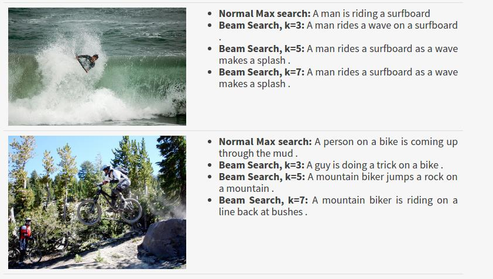

# 学习RNN神经网络


循环神经网络可以用来解决各种序列问题， 本项目给出一些常见的循环神经网络的使用场景和代码实现。 


## 1. 用numpy实现简单的RNN

实现一个简单的RNN， 预测字符串序列, 理解一些常用的矩阵运算， 以及前向、反向传播


以下是RNN的计算公式


## 2. 对比LSTM 和RNN

* 理解序列问题的数据格式
* 对比LSTM 处理长序列问题的能力

```
 s=0.7581    m=1
 s=0.7010    m=0
 s=0.1807    m=0
 s=0.8387    m=0
 s=0.6760    m=0
 s=0.3419    m=0
 ......
 s=0.0420    m=0
 s=0.8913    m=0
 s=0.3688    m=1
 s=0.8188    m=0
```

 s列和m列想乘 再求和 等于y = 1.1269， 其中有两个m是1，剩余都为0
 
 这个序列的长度会达到比较长， 如果用普通RNN很难发现规律，体验LSTM的威力


## 3. 使用Tensorflow 实现RNN 预测Sin函数图像

* 理解序列问题数据处理方式， X 和y的数据格式。 
* 熟悉Tensorflow 构建网络模型的常规流程。 


## 4. 使用LSTM 对mnist 手写数字集进行分类

将每行数据看做时序序列对图像进行分类。 


## 5. 实现自己的LSTM 

通过实现LSTM， 理解LSTM cell的内部结构， 加深理解。 


## 6. 通过Encoder Decoder实现问答系统

序列到序列的模型， 核心就是研究如何处理序列的问题。 

```
Q: 24+654
A: 678
```
程序读取问题字符串，通过和答案的对比， 发现序列里面的规律。  


## 7. 使用PyTorch实现字符级别的英语文章预测

以下是预测出的文本
```
The moss of the convincing it had been drawing up the people that there was nothing without 
this way or a single wife as he did not hear him or that he was not seeing that she would 
be a court of the sound of some sound of the position, and to spartly she could see her 
and a sundroup times there was nothing this father and as she stoop serious in the sound, 
was a steps of the master, a few sistersily play of his husband. The crowd had no carreated
herself, and truets, and shaking up, the pases, and the moment that he was not at the marshal,
and the starling the secret were stopping to be
```


## 8. 中文文章的分类

* 熟悉多对一个序列问题的解决方案
* 熟悉中文文档的分词处理流程

里面使用了9类文章， 每类文章有5000片文章。 

| 分类标签 | 出现的数量 |
| :-----| ----: |
| 体育 | 5000 |
| 娱乐 | 5000 |
| 家居 | 5000 |
| 房产 | 5000 |
| 时尚 | 5000 |
| 时政 | 5000 |
| 游戏 | 5000 |
| 科技 | 5000 |
| 财经 | 5000 |


## 9. 英语到西班牙的翻译功能

* 熟悉多对多的序列问题
* 熟悉Attention模型

以下是一些样本数据：
```
You don't look the same.	No luces lo mismo.
You don't pay attention.	No prestás atención.
You don't smoke, do you?	No fumas, ¿verdad?
You drink too much, Tom.	Bebes demasiado, Tom.
You dropped your pencil.	Se te ha caído el lápiz.
You dropped your pencil.	Se te cayó el lápiz.
You go there without me.	Tú ve allá sin mí.
You go to school, right?	Tú vas a la escuela, ¿сierto?
You guys need new shoes.	Necesitáis zapatos nuevos.
You handled that deftly.	Manejaste eso hábilmente.
You have a lot of books.	Tú tienes muchos libros.
You have a pretty smile.	Tienes una linda sonrisa.
You have beautiful eyes.	Tienes unos ojos muy bonitos.
```


## 10. 自动作曲

* 熟悉声音文件的处理
* 熟悉声音序列问题的处理方式


## 11. 自动完成阅读理解

通过记忆网络实现问答系统， 记忆网络将信息保存到网络外部， 类比LSTM的长期记忆， 范围和尺度还要更广。 


```
Daniel moved to the garden . Mary went back to the bathroom .

Q: Where is Daniel ?

A: garden
```


```
John went to the bedroom . Daniel journeyed to the kitchen . Daniel journeyed to the hallway . 
Mary travelled to the bathroom . John travelled to the garden . Daniel journeyed to the office .
Mary moved to the bedroom . Sandra went back to the hallway .

Q: Where is Sandra ?

A: hallway

```


## 12. 通过手机传感器预测人类运动

熟悉时间序列的处理方式


对应的6个分类： 
```
    "WALKING"
    "WALKING_UPSTAIRS"
    "WALKING_DOWNSTAIRS" 
    "SITTING" 
    "STANDING"
    "LAYING"
```

一个时间序列有128组数据， 每组9个值。 
```
    "body_acc_x_",
    "body_acc_y_",
    "body_acc_z_",
    "body_gyro_x_",
    "body_gyro_y_",
    "body_gyro_z_",
    "total_acc_x_",
    "total_acc_y_",
    "total_acc_z_",
```


## 13. 通过图片生成文字解说

* 了解一对多的序列处理问题
* 使用CNN 提取图片的特征，然后输入到LSTM里面进行Decoder。



 
 


## 14. 生成周杰伦的歌词

* 使用Mxnet实现LSTM
* 熟悉LSTM 的公式

以下是在小数据集上，迭代了500次以后生成的歌词
>  喜欢 问候我 谁是神枪手 巫师 他念念 有词的 对酋长下诅咒 还我骷髅头 这故事 告诉我 印地安的传说 
>  
>  不分开 你已经离开我 不知不觉 我跟了这节奏 后知后觉 又过了一个秋 后知后觉 我该好好生活 我该好好生活


## 15. 图像生成HTML代码

* 了解CNN和RNN的混合使用
* Keras 使用多输入模型


